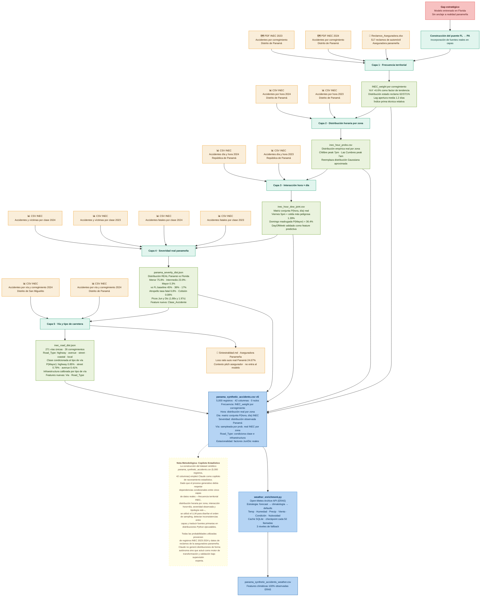

```mermaid
flowchart TD

    %% ── CONSTRUCCIÓN DEL PUENTE FL→PA ────────────────────────────
    GAP["`**Gap estratégico**
    Modelo entrenado en Florida
    Sin anclaje a realidad panameña`"] --> CAPAS["`**Construcción del puente FL → PA**
    Incorporación de fuentes reales en capas`"]

    %% ── CAPA 1: FRECUENCIA TERRITORIAL ───────────────────────────
    CAPAS --> C1["`**Capa 1 · Frecuencia territorial**`"]

    RECLAMOS_PA["`📄 Reclamos_Aseguradora.xlsx
    517 reclamos de automóvil
    Aseguradora panameña`"]
    INEC_MAP1["`🗺️ PDF INEC 2024
    Accidentes por corregimiento
    Distrito de Panamá`"]
    INEC_MAP2["`🗺️ PDF INEC 2023
    Accidentes por corregimiento
    Distrito de Panamá`"]

    RECLAMOS_PA --> C1
    INEC_MAP1 --> C1
    INEC_MAP2 --> C1

    C1 --> OUT1["`INEC_weight por corregimiento
    YoY +6.6% como factor de tendencia
    Distribución estado reclamo 62/37/1%
    Lag apertura media 1.2 días
    Índice prima técnica relativa`"]

    %% ── CAPA 2: HORA POR CORREGIMIENTO ───────────────────────────
    OUT1 --> C2["`**Capa 2 · Distribución horaria por zona**`"]

    CSV_H1["`📊 CSV INEC
    Accidentes por hora 2023
    Distrito de Panamá`"]
    CSV_H2["`📊 CSV INEC
    Accidentes por hora 2024
    Distrito de Panamá`"]

    CSV_H1 --> C2
    CSV_H2 --> C2

    C2 --> OUT2["`inec_hour_probs.csv
    Distribución empírica real por zona
    Chilibre peak 7pm · Las Cumbres peak 7am
    Reemplaza distribución Gaussiana aproximada`"]

    %% ── CAPA 3: HORA × DÍA ────────────────────────────────────────
    OUT2 --> C3["`**Capa 3 · Interacción hora × día**`"]

    CSV_D1["`📊 CSV INEC
    Accidentes día y hora 2023
    República de Panamá`"]
    CSV_D2["`📊 CSV INEC
    Accidentes día y hora 2024
    República de Panamá`"]

    CSV_D1 --> C3
    CSV_D2 --> C3

    C3 --> OUT3["`inec_hour_dow_joint.csv
    Matriz conjunta P\(hora, día\) real
    Viernes 5pm = celda más peligrosa 1.39%
    Domingo madrugada P\(Mayor\) = 36.4%
    DayOfWeek validado como feature predictiva`"]

    %% ── CAPA 4: SEVERIDAD REAL ────────────────────────────────────
    OUT3 --> C4["`**Capa 4 · Severidad real panameña**`"]

    CSV_F1["`📊 CSV INEC
    Accidentes fatales por clase 2023`"]
    CSV_F2["`📊 CSV INEC
    Accidentes fatales por clase 2024`"]
    CSV_V1["`📊 CSV INEC
    Accidentes y víctimas por clase 2023`"]
    CSV_V2["`📊 CSV INEC
    Accidentes y víctimas por clase 2024`"]

    CSV_F1 --> C4
    CSV_F2 --> C4
    CSV_V1 --> C4
    CSV_V2 --> C4

    C4 --> OUT4["`panama_severity_dist.json
    Distribución REAL Panamá vs Florida
    Menor 75.8% · Intermedio 23.9% · Mayor 0.3%
    vs FL baseline 45% · 38% · 17%
    Atropello tasa fatal 6.8% · Colisión 0.08%
    Picos Jun y Dic \(1.88x y 1.97x\)
    Feature nueva: Clase_Accidente`"]

    %% ── CAPA 5: VÍA Y TIPO DE CARRETERA ──────────────────────────
    OUT4 --> C5["`**Capa 5 · Vía y tipo de carretera**`"]

    CSV_C1["`📊 CSV INEC
    Accidentes por vía y corregimiento 2024
    Distrito de Panamá`"]
    CSV_C2["`📊 CSV INEC
    Accidentes por vía y corregimiento 2024
    Distrito de San Miguelito`"]

    CSV_C1 --> C5
    CSV_C2 --> C5

    C5 --> OUT5["`inec_road_dist.json
    271 vías únicas · 26 corregimientos
    Road_Type: highway · avenue · street · coastal · local
    Clase condicionada al tipo de vía
    P\(Mayor\): highway 0.85% · street 0.79% · avenue 0.41%
    Infraestructura calibrada por tipo de vía
    Features nuevas: Via · Road_Type`"]

    %% ── CONTEXTO COMERCIAL ────────────────────────────────────────
    C5 --> COM["`📄 Siniestralidad.md · Aseguradora Panameña
    Loss ratio auto real Panamá 24.67%
    Contexto pitch asegurador · no entra al modelo`"]

    %% ── DATASET SINTÉTICO FINAL ───────────────────────────────────
    OUT1 & OUT2 & OUT3 & OUT4 & OUT5 --> DS

    DS["`**panama_synthetic_accidents.csv v5**
    5,000 registros · 42 columnas · 0 nulos
    Frecuencia: INEC_weight por corregimiento
    Hora: distribución real por zona
    Día: matriz conjunta P\(hora, día\) INEC
    Severidad: distribución observada Panamá
    Vía: sampleada por prob. real INEC por zona
    Road_Type: condiciona clase e infraestructura
    Estacionalidad: factores Jun/Dic reales`"]

    DS -.-> NOTE["`**Nota Metodológica: Copiloto Estadístico**
    La construcción del dataset sintético
    *panama_synthetic_accidents.csv* (5,000 registros,
    42 columnas) empleó Claude como copiloto
    de razonamiento estadístico.

    Dado que el proceso generativo debía respetar
    dependencias condicionales entre cinco capas
    de datos reales —frecuencia territorial INEC,
    distribución horaria por zona, interacción
    hora×día, severidad observada y tipología vial—,
    se utilizó el LLM para diseñar el orden
    de sampling, detectar inconsistencias entre
    capas y traducir fuentes primarias en
    distribuciones Python ejecutables.

    Todas las probabilidades utilizadas provienen
    de registros INEC 2023-2024 y datos de
    reclamos de la aseguradora panameña;
    Claude no generó distribuciones de forma
    autónoma sino que actuó como motor de
    transformación y validación bajo supervisión
    experta.`"]

    %% ── WEATHER ENRICHMENT ────────────────────────────────────────
    DS --> WX["`**weather_enrichment.py**
    Open-Meteo Archive API \(ERA5\)
    Estrategia: forecast → climatología → defaults
    Temp · Humedad · Precip · Viento · Condición · Nubosidad
    Cache SQLite · checkpoint cada 50 llamadas
    3 niveles de fallback`"]

    WX --> DS_W["`panama_synthetic_accidents_weather.csv
    Features climáticas 100% observadas ERA5`"]

    %% ── ESTILOS ───────────────────────────────────────────────────
    classDef inicio    fill:#D3D1C7,stroke:#888780,color:#2C2C2A,font-size:11px
    classDef gap       fill:#F7C1C1,stroke:#E24B4A,color:#501313,font-size:11px
    classDef fix       fill:#B5D4F4,stroke:#378ADD,color:#042C53,font-size:11px
    classDef modelo    fill:#B5D4F4,stroke:#378ADD,color:#042C53,font-size:11px
    classDef fuente    fill:#FAEEDA,stroke:#EF9F27,color:#412402,font-size:11px
    classDef capa      fill:#E1F5EE,stroke:#1D9E75,color:#04342C,font-size:11px
    classDef output    fill:#EAF3DE,stroke:#639922,color:#173404,font-size:11px
    classDef dataset   fill:#B5D4F4,stroke:#185FA5,color:#042C53,font-size:11px
    classDef app       fill:#CECBF6,stroke:#7F77DD,color:#26215C,font-size:11px
    classDef pendiente fill:#F1EFE8,stroke:#B4B2A9,color:#444441,font-size:11px
    classDef nota      fill:#FFFDE7,stroke:#FFF59D,color:#5D4037,stroke-width:1px,stroke-dasharray: 5 5,font-size:10px

    class GAP gap
    class CAPAS capa
    class RECLAMOS_PA,INEC_MAP1,INEC_MAP2,CSV_H1,CSV_H2,CSV_D1,CSV_D2,CSV_F1,CSV_F2,CSV_V1,CSV_V2,CSV_C1,CSV_C2 fuente
    class C1,C2,C3,C4,C5 capa
    class OUT1,OUT2,OUT3,OUT4,OUT5 output
    class COM fuente
    class DS,DS_W dataset
    class WX fix
    class NOTE nota
```