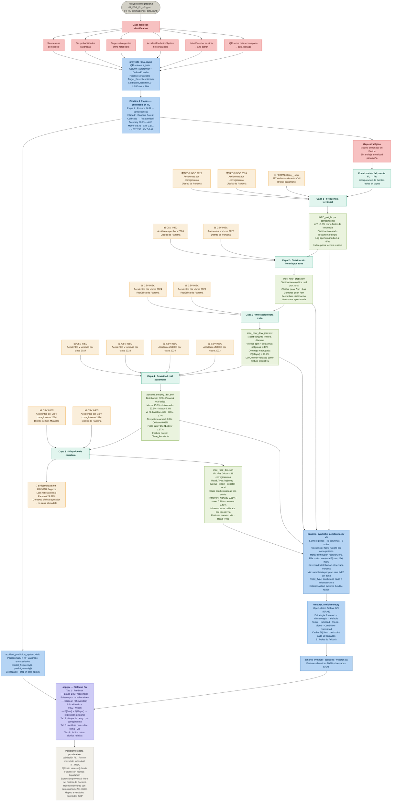

```mermaid
flowchart TD

    %% ── PUNTO DE PARTIDA ──────────────────────────────────────────
    A(["`**Proyecto Integrador 2**
    04_EDA_FL_v2.ipynb · 04_FL_estimaciones_beta.ipynb`"])

    %% ── FIXES TÉCNICOS ────────────────────────────────────────────
    A --> B["`**Gaps técnicos identificados**`"]

    B --> F1["`IQR sobre dataset completo
    → data leakage`"]
    B --> F2["`LabelEncoder en ciclo
    → anti-patrón`"]
    B --> F3["`AccidentPredictionSystem
    no serializable`"]
    B --> F4["`Targets divergentes
    entre notebooks`"]
    B --> F5["`Sin probabilidades
    calibradas`"]
    B --> F6["`Sin métricas
    de negocio`"]

    F1 & F2 & F3 & F4 & F5 & F6 --> FIX

    FIX["`**proyecto_final.ipynb**
    IQR solo en X_train · ColumnTransformer + OrdinalEncoder
    Pipeline serializable · Target_Severity unificado
    CalibratedClassifierCV · Lift Curve + Gini`"]

    %% ── MODELO BASE FL ────────────────────────────────────────────
    FIX --> MOD

    MOD["`**Pipeline 2 Etapas — entrenado en FL**
    Etapa 1 · Poisson GLM → E\[Frecuencia\]
    Etapa 2 · Random Forest Calibrado → P\(Severidad\)
    Accuracy 60.9% · AUC Mayor 0.836 · Gini 0.671
    n = 617,735 · CV 5-fold`"]

    %% ── PROBLEMA ESTRATÉGICO ──────────────────────────────────────
    MOD --> GAP["`**Gap estratégico**
    Modelo entrenado en Florida
    Sin anclaje a realidad panameña`"]

    %% ── CONSTRUCCIÓN DEL PUENTE FL→PA ────────────────────────────
    GAP --> CAPAS["`**Construcción del puente FL → PA**
    Incorporación de fuentes reales en capas`"]

    %% ── CAPA 1: FRECUENCIA TERRITORIAL ───────────────────────────
    CAPAS --> C1["`**Capa 1 · Frecuencia territorial**`"]

    FEDPA["`📄 FEDPAListado__.xlsx
    517 reclamos de automóvil
    Broker panameño`"]
    INEC_MAP1["`🗺️ PDF INEC 2024
    Accidentes por corregimiento
    Distrito de Panamá`"]
    INEC_MAP2["`🗺️ PDF INEC 2023
    Accidentes por corregimiento
    Distrito de Panamá`"]

    FEDPA --> C1
    INEC_MAP1 --> C1
    INEC_MAP2 --> C1

    C1 --> OUT1["`INEC_weight por corregimiento
    YoY +6.6% como factor de tendencia
    Distribución estado reclamo 62/37/1%
    Lag apertura media 1.2 días
    Índice prima técnica relativa`"]

    %% ── CAPA 2: HORA POR CORREGIMIENTO ───────────────────────────
    OUT1 --> C2["`**Capa 2 · Distribución horaria por zona**`"]

    CSV_H1["`📊 CSV INEC
    Accidentes por hora 2023
    Distrito de Panamá`"]
    CSV_H2["`📊 CSV INEC
    Accidentes por hora 2024
    Distrito de Panamá`"]

    CSV_H1 --> C2
    CSV_H2 --> C2

    C2 --> OUT2["`inec_hour_probs.csv
    Distribución empírica real por zona
    Chilibre peak 7pm · Las Cumbres peak 7am
    Reemplaza distribución Gaussiana aproximada`"]

    %% ── CAPA 3: HORA × DÍA ────────────────────────────────────────
    OUT2 --> C3["`**Capa 3 · Interacción hora × día**`"]

    CSV_D1["`📊 CSV INEC
    Accidentes día y hora 2023
    República de Panamá`"]
    CSV_D2["`📊 CSV INEC
    Accidentes día y hora 2024
    República de Panamá`"]

    CSV_D1 --> C3
    CSV_D2 --> C3

    C3 --> OUT3["`inec_hour_dow_joint.csv
    Matriz conjunta P\(hora, día\) real
    Viernes 5pm = celda más peligrosa 1.39%
    Domingo madrugada P\(Mayor\) = 36.4%
    DayOfWeek validado como feature predictiva`"]

    %% ── CAPA 4: SEVERIDAD REAL ────────────────────────────────────
    OUT3 --> C4["`**Capa 4 · Severidad real panameña**`"]

    CSV_F1["`📊 CSV INEC
    Accidentes fatales por clase 2023`"]
    CSV_F2["`📊 CSV INEC
    Accidentes fatales por clase 2024`"]
    CSV_V1["`📊 CSV INEC
    Accidentes y víctimas por clase 2023`"]
    CSV_V2["`📊 CSV INEC
    Accidentes y víctimas por clase 2024`"]

    CSV_F1 --> C4
    CSV_F2 --> C4
    CSV_V1 --> C4
    CSV_V2 --> C4

    C4 --> OUT4["`panama_severity_dist.json
    Distribución REAL Panamá vs Florida
    Menor 75.8% · Intermedio 23.9% · Mayor 0.3%
    vs FL baseline 45% · 38% · 17%
    Atropello tasa fatal 6.8% · Colisión 0.08%
    Picos Jun y Dic \(1.88x y 1.97x\)
    Feature nueva: Clase_Accidente`"]

    %% ── CAPA 5: VÍA Y TIPO DE CARRETERA ──────────────────────────
    OUT4 --> C5["`**Capa 5 · Vía y tipo de carretera**`"]

    CSV_C1["`📊 CSV INEC
    Accidentes por vía y corregimiento 2024
    Distrito de Panamá`"]
    CSV_C2["`📊 CSV INEC
    Accidentes por vía y corregimiento 2024
    Distrito de San Miguelito`"]

    CSV_C1 --> C5
    CSV_C2 --> C5

    C5 --> OUT5["`inec_road_dist.json
    271 vías únicas · 26 corregimientos
    Road_Type: highway · avenue · street · coastal · local
    Clase condicionada al tipo de vía
    P\(Mayor\): highway 0.85% · street 0.79% · avenue 0.41%
    Infraestructura calibrada por tipo de vía
    Features nuevas: Via · Road_Type`"]

    %% ── CONTEXTO COMERCIAL ────────────────────────────────────────
    C5 --> COM["`📄 Siniestralidad.md · RAFMAR Seguros
    Loss ratio auto real Panamá 24.67%
    Contexto pitch asegurador · no entra al modelo`"]

    %% ── DATASET SINTÉTICO FINAL ───────────────────────────────────
    OUT1 & OUT2 & OUT3 & OUT4 & OUT5 --> DS

    DS["`**panama_synthetic_accidents.csv v5**
    5,000 registros · 42 columnas · 0 nulos
    Frecuencia: INEC_weight por corregimiento
    Hora: distribución real por zona
    Día: matriz conjunta P\(hora, día\) INEC
    Severidad: distribución observada Panamá
    Vía: sampleada por prob. real INEC por zona
    Road_Type: condiciona clase e infraestructura
    Estacionalidad: factores Jun/Dic reales`"]

    %% ── WEATHER ENRICHMENT ────────────────────────────────────────
    DS --> WX["`**weather_enrichment.py**
    Open-Meteo Archive API \(ERA5\)
    Estrategia: forecast → climatología → defaults
    Temp · Humedad · Precip · Viento · Condición · Nubosidad
    Cache SQLite · checkpoint cada 50 llamadas
    3 niveles de fallback`"]

    WX --> DS_W["`panama_synthetic_accidents_weather.csv
    Features climáticas 100% observadas ERA5`"]

    %% ── MODELO SERIALIZADO ────────────────────────────────────────
    MOD --> JOBLIB["`accident_prediction_system.joblib
    Poisson GLM + RF Calibrado encapsulados
    predict_frequency\(\) · predict_severity\(\)
    Serializable · drop-in para app.py`"]

    %% ── DASHBOARD ─────────────────────────────────────────────────
    DS_W & JOBLIB --> APP

    APP["`**app.py — RiskMap PA**
    Tab 1 · Predictor
    — Etapa 1: E\[Frecuencia\] Poisson por zona/hora/mes
    — Etapa 2: P\(Severidad\) RF calibrado + INEC_weight
    — E\[Frec\] × P\(Mayor\) → exposición actuarial
    Tab 2 · Mapa de riesgo por corregimiento
    Tab 3 · Análisis hora · día · clima · vía
    Tab 4 · Índice prima técnica relativa`"]

    %% ── PENDIENTES ────────────────────────────────────────────────
    APP --> PEN["`**Pendientes para producción**
    Validación FL→PA con microdato individual TTT/INEC
    E\[Costo siniestro\] desde FEDPA con montos liquidación
    Expansión provincial fuera del Distrito de Panamá
    Reentrenamiento con datos panameños reales
    Mapeo a variables permitidas SBP`"]

    %% ── ESTILOS ───────────────────────────────────────────────────
    classDef inicio    fill:#D3D1C7,stroke:#888780,color:#2C2C2A
    classDef gap       fill:#F7C1C1,stroke:#E24B4A,color:#501313
    classDef fix       fill:#B5D4F4,stroke:#378ADD,color:#042C53
    classDef modelo    fill:#B5D4F4,stroke:#378ADD,color:#042C53
    classDef fuente    fill:#FAEEDA,stroke:#EF9F27,color:#412402
    classDef capa      fill:#E1F5EE,stroke:#1D9E75,color:#04342C
    classDef output    fill:#EAF3DE,stroke:#639922,color:#173404
    classDef dataset   fill:#B5D4F4,stroke:#185FA5,color:#042C53
    classDef app       fill:#CECBF6,stroke:#7F77DD,color:#26215C
    classDef pendiente fill:#F1EFE8,stroke:#B4B2A9,color:#444441

    class A inicio
    class B,F1,F2,F3,F4,F5,F6 gap
    class FIX,MOD fix
    class GAP gap
    class CAPAS capa
    class FEDPA,INEC_MAP1,INEC_MAP2,CSV_H1,CSV_H2,CSV_D1,CSV_D2,CSV_F1,CSV_F2,CSV_V1,CSV_V2,CSV_C1,CSV_C2 fuente
    class C1,C2,C3,C4,C5 capa
    class OUT1,OUT2,OUT3,OUT4,OUT5 output
    class COM fuente
    class DS,DS_W dataset
    class WX,JOBLIB fix
    class APP app
    class PEN pendiente
```